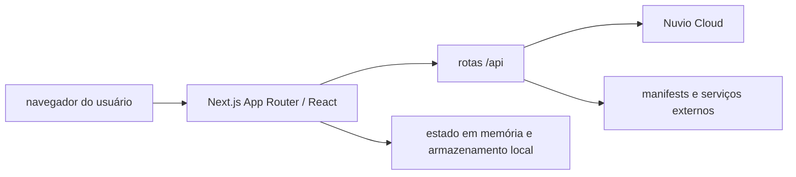

# Arquitetura

## Visão geral

O Nuvio Control Center é uma aplicação web pessoal para consultar e manter dados de perfis Nuvio. A interface roda no navegador; as rotas do Next.js fazem chamadas autenticadas ao Nuvio Cloud e intermediam operações externas que precisam de validação de rede. O Nuvio Cloud continua sendo a fonte principal dos dados sincronizados. O projeto não mantém um banco de dados próprio.

## Estrutura do repositório

| Caminho | Responsabilidade |
| --- | --- |
| `app/page.tsx` | Aplicação principal: navegação, perfis, addons, catálogos, coleções, plugins, progresso e manutenção. |
| `app/api/nuvio/*` | Login, renovação de sessão, inventário, dados paginados, diagnóstico, prévia e gravação no Nuvio Cloud. |
| `app/api/import-url` | Importação de JSON por URL externa. |
| `app/api/trakt/*` | Leitura e sincronização de coleções com Trakt. |
| `components/` | Componentes de tela reutilizados, incluindo biblioteca e histórico de reprodução. |
| `lib/nuvio.ts` | Tipos, normalização e regras de domínio para os dados Nuvio. |
| `lib/nuvio-client.ts` | Cliente servidor para chamadas ao Nuvio Cloud. |
| `lib/safe-external-fetch.ts` | Busca de URL pública com validação de DNS/IP e limites contra SSRF. |
| `lib/bounded-fetch.ts`, `lib/request-json.ts` | Limites de tempo e tamanho para respostas e corpos HTTP. |
| `lib/sync-safety.ts` | Comparação e validação de gravações antes de considerar sincronização concluída. |
| `lib/local-snapshots.ts` | Snapshots e cópias locais no navegador. |
| `docs/` | Guias de arquitetura, API e desenvolvimento. |

## Dados e estado

| Dado | Onde fica | Observação |
| --- | --- | --- |
| Inventário e configurações sincronizados | Nuvio Cloud | Fonte autoritativa da conta. |
| Token de acesso | Memória do navegador | Enviado às rotas servidoras para chamadas Nuvio. |
| Refresh token e e-mail | `localStorage` | Usados para recuperar a sessão neste navegador. |
| Snapshots e fingerprint local | `localStorage` | Cópias/ajuda local; não substituem a conta Nuvio. |
| Diagnósticos de addons | Estado da aplicação por perfil | Permanecem durante a sessão da página; não sincronizam entre dispositivos. |
| Tokens Trakt | Estado do cliente e corpo da chamada | Não são persistidos pelo servidor do projeto. |

## Fluxos importantes

1. A interface autentica o usuário pelas rotas `/api/nuvio/sign-in` e `/api/nuvio/refresh`.
2. `/api/nuvio/inventory` carrega os perfis e seus dados principais. Biblioteca e histórico podem ser carregados sob demanda por `/api/nuvio/profile-data`.
3. Ações de manutenção enviam mudanças a `/api/nuvio/mutate`. Alterações de catálogo são relidas e comparadas antes de serem consideradas salvas.
4. O diagnóstico consulta manifestos e catálogos dos addons no servidor. A rota transmite progresso por SSE e oferece resposta JSON para clientes que não conseguem consumir o fluxo.
5. Importações e diagnósticos de URL usam `safe-external-fetch`; destinos privados, redirecionamentos inseguros e respostas acima dos limites são rejeitados.

## Limites de confiança

- As rotas Nuvio exigem token enviado pelo cliente, mas o projeto não implementa uma camada própria de autenticação de usuários. Não publique como serviço multiusuário sem projetar essa fronteira.
- Endpoints de URL externa não devem usar `fetch` irrestrito. Use as funções de busca limitada e validação existentes.
- Mensagens e resultados de diagnóstico são observações de rede do momento, não garantias de disponibilidade permanente do addon.
- O arquivo `app/page.tsx` ainda concentra boa parte da interface e da coordenação de estado. Mudanças estruturais devem ser pequenas e preservar os contratos das rotas e o isolamento do estado por perfil.
